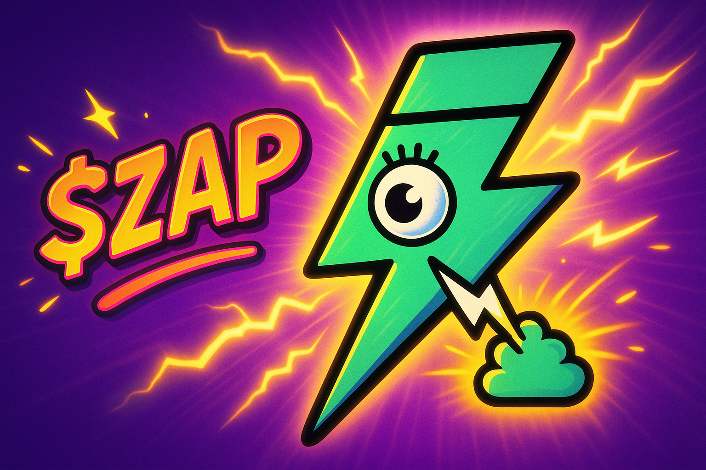
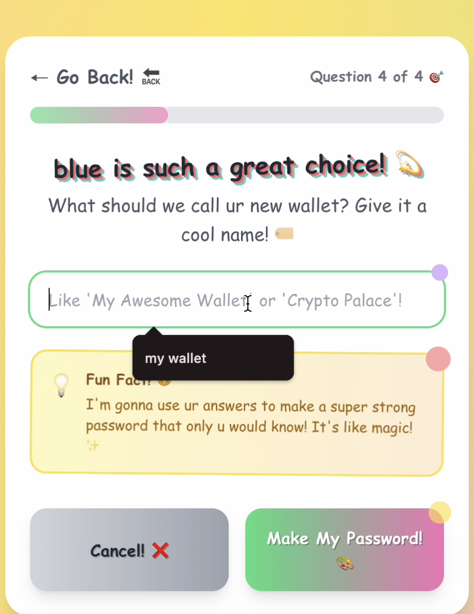
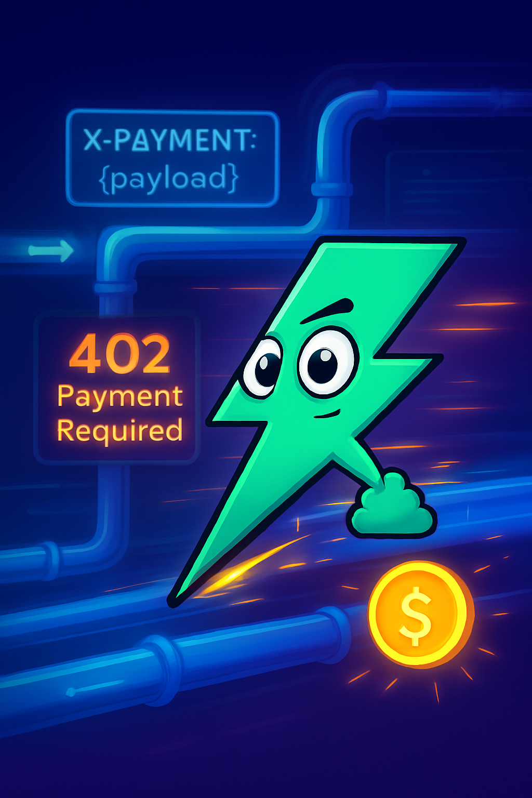
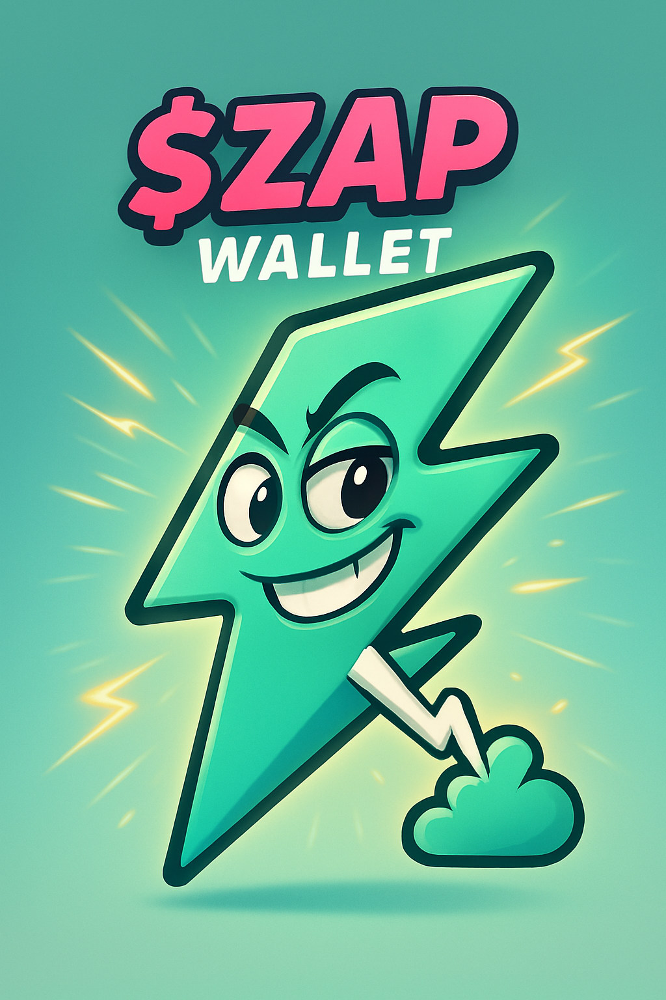
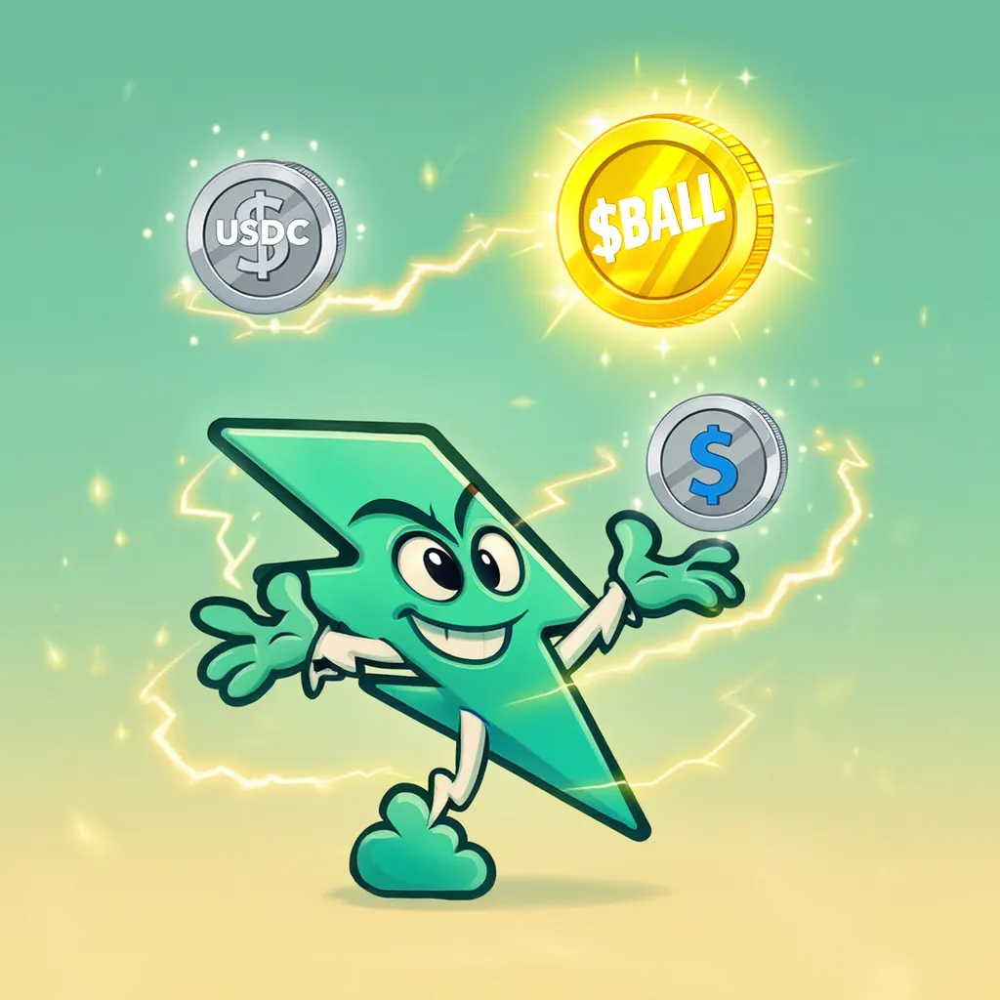
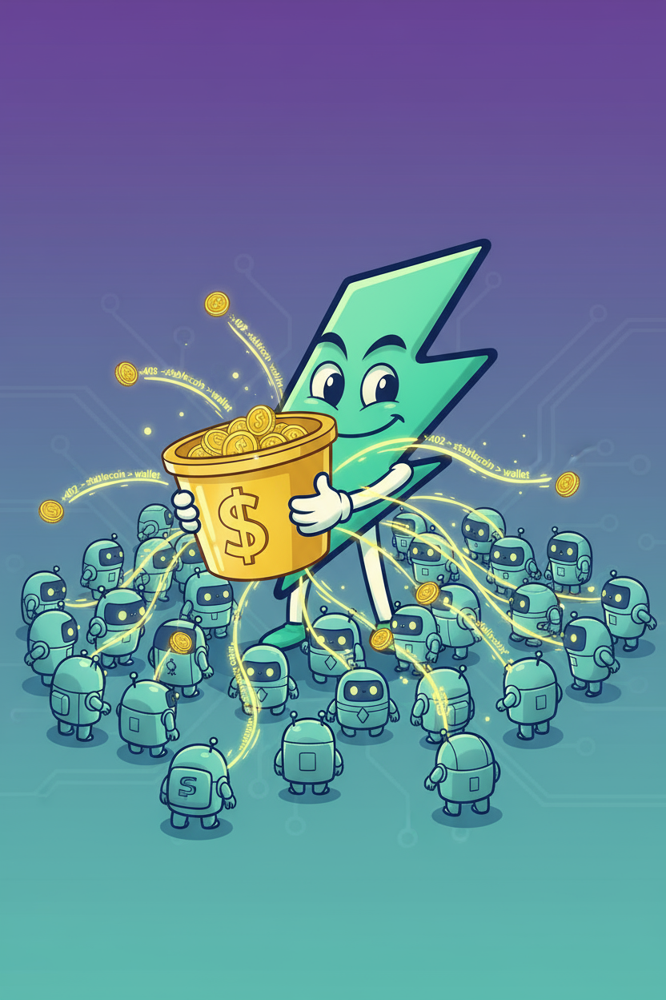
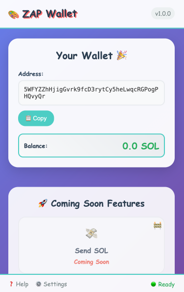

# ZAP Wallet 🎨✨⚡

**The Phantom Killer - The Fun Way to Create and Manage Solana Wallets!**



ZAP Wallet is a user-friendly, AI-powered Solana wallet that makes crypto accessible to everyone. With our colorful, engaging interface, advanced privacy features, and revolutionary wallet creation experience, we're coming for Phantom's market share.

## 🎥 Watch ZAP Wallet in Action

https://github.com/user-attachments/assets/wallet-creation.mp4

Check out our [promo video](public/videos/mp4/promo-vid-vertical.mp4) or explore the [art gallery](#-art-gallery) to see our amazing designs!

## 🌟 Key Features

### 🎯 **Core Wallet Features**
- **Real Solana Wallets**: Generate actual blockchain wallets compatible with Phantom and other Solana wallets
- **BIP44 Compatible**: Uses proper derivation paths for maximum compatibility
- **Secure Generation**: BIP39 mnemonic phrases with advanced encryption
- **Multi-Wallet Support**: Create and manage multiple wallets
- **Import/Export**: Full wallet recovery and backup capabilities
- **Network Switching**: Switch between Mainnet and Devnet with visual indicators
- **QR Code Deposits**: Easy mobile deposits via QR code scanning

### 🎨 **User Experience**
- **Video Intro**: Cinematic video introduction when you first visit
- **AI-Powered Interface**: Conversational wallet creation process
- **Colorful Design**: Fun, engaging UI with green/yellow color scheme
- **Privacy Controls**: Hide/show sensitive information for screen sharing
- **Smart Notifications**: Real-time feedback and guidance
- **Mobile-First**: Responsive design for all devices
- **Art Gallery**: Beautiful mascot designs and artwork showcase

### 🔒 **Privacy Features** 🛡️
- **Multi-Layer Privacy System**: 
  - **Basic Privacy**: Jito bundles for mempool privacy
  - **Advanced Privacy**: Stealth addresses + mixing pools
  - **Maximum Privacy**: Full privacy with time delays and ZK proofs (future)
- **Zero-Knowledge Architecture**: Private keys never leave your device
- **Encrypted Storage**: All wallet data is locally encrypted
- **MEV Protection**: Jito bundles prevent front-running
- **Transaction Graph Breaking**: Stealth addresses break transaction links


### 💰 **Micropayment Gateway**
- **x402-Inspired System**: Low-cost per-use payments for dApps and services
- **Paywall Integration**: Premium content access with instant micropayments
- **Service Provider System**: Register and manage payment recipients
- **Pool Management**: Dedicated micropayment pool with auto top-up
- **x402scan Compliant**: Full x402scan schema implementation for service discovery

### 🐦 **Social Features**
- **Twitter Leaderboard**: Track and rank users mentioning @ZAPzipWallet
- **Community Integration**: See who's supporting the project
- **Recent Mentions**: View latest Twitter activity
- **Auto-Refresh**: Real-time leaderboard updates

### 🚀 **Advanced Features**
- **SPL Token Support**: Full support for Solana tokens
- **DeFi Integration**: Connect to Solana DeFi protocols
- **Private Swaps**: Jupiter DEX integration with privacy features
- **Cross-Platform**: Works on web, mobile, and as browser extension
- **WebGPU Demo**: Interactive 3D visualizations

## 📸 Screenshots & Gallery

### Wallet Creation Flow





### Demo Videos

| Wallet Creation | Working Transfers | Demo |
|----------------|-------------------|------|
|  |  |  |

[Watch Full Videos →](public/videos/mp4/)

## 🎨 Art Gallery






[View Full Gallery →](#art-gallery)

## 🛠️ Installation

### Development Setup

```bash
# Clone the repository
git clone https://github.com/zapzipwallet/zap-wallet.git
cd zap-wallet

# Install dependencies
npm install

# Start development server
npm start
```

### Production Build

```bash
# Create production build
npm run build

# Serve the build
npm install -g serve
serve -s build
```

### Backend Setup (Micropayments)

```bash
# Navigate to backend directory
cd src/micropayments/backend

# Install backend dependencies
npm install

# Start backend server
npm start
# Server runs on http://localhost:3001
```

### Environment Variables

Create a `.env` file in the root directory:

```env
# Twitter API (optional, for leaderboard)
TWITTER_BEARER_TOKEN=your_twitter_bearer_token

# Solana RPC (optional, defaults to public RPC)
SOLANA_RPC_URL=your_rpc_url

# API URL (for production)
REACT_APP_API_URL=http://localhost:3001
```

## 📱 Usage

### Creating Your First Wallet

1. **Start the App**: Open ZAP Wallet in your browser
2. **Watch Intro**: Enjoy the cinematic video intro (or skip it)
3. **Begin Creation**: Click "Create New Wallet" 
4. **Answer Questions**: Our AI will ask you fun questions to personalize your experience
5. **Secure Your Wallet**: Write down your seed phrase safely
6. **Start Using**: Your wallet is ready for Solana transactions!

### Managing Multiple Wallets

- **Create Additional Wallets**: Use the "Make Another Wallet" button
- **Switch Between Wallets**: Select from your wallet list
- **Export Wallet Data**: Download secure backup files
- **Import Existing Wallets**: Use seed phrases from other wallets

### Using Privacy Features

1. **Access Privacy Settings**: Navigate to Privacy tab in wallet settings
2. **Choose Privacy Level**:
   - **None**: Standard transactions (fastest, lowest cost)
   - **Basic**: Jito bundles for mempool privacy
   - **Advanced**: Full stealth address system with mixing
3. **Make Transfer**: Privacy level is applied automatically
4. **View Details**: Check transaction cost breakdown and privacy features

### Micropayment Gateway

```javascript
// Initialize micropayment gateway
const gateway = new MicropaymentGateway({
  connection: connection,
  autoTopUp: true,
  minPoolBalance: 0.01, // SOL
  topUpAmount: 0.1      // SOL
});

// Process micropayment
const result = await gateway.processMicropayment({
  serviceId: 'my-service',
  amount: 0.001, // SOL
  description: 'API call payment'
});
```

## 🔧 Development

### Project Structure

```
zap-wallet/
├── src/
│   ├── components/
│   │   ├── Wallet.js              # Main wallet interface
│   │   ├── WalletCreation.js      # Wallet creation flow
│   │   ├── LandingPage.js         # Landing page with video intro & gallery
│   │   ├── SupportPage.js         # Support page with Twitter leaderboard
│   │   ├── TwitterLeaderboard.js  # Twitter leaderboard component
│   │   ├── PrivacySettings.js     # Privacy controls
│   │   └── NotificationSystem.js # User notifications
│   ├── privacy/
│   │   ├── modules/
│   │   │   ├── EnhancedStealthTransfer.js # Advanced privacy
│   │   │   ├── JitoPrivateRPC.js          # Jito integration
│   │   │   └── PrivacySwapRouter.js       # Private swaps
│   │   └── EnhancedPrivacyManager.js      # Privacy orchestrator
│   ├── micropayments/
│   │   ├── MicropaymentGateway.js    # Micropayment system
│   │   ├── PaywallComponent.js        # React paywall
│   │   ├── backend/
│   │   │   └── server.js              # Express.js backend
│   │   └── x402/
│   │       └── X402Schema.js          # x402scan schema
│   ├── contexts/
│   │   └── WalletContextProvider.js
│   └── App.js
├── public/
│   ├── images/
│   │   ├── art/                    # Art gallery images
│   │   ├── wallet-flow/            # Wallet creation flow
│   │   └── screenshots/            # Demo screenshots
│   └── videos/
│       ├── mp4/                    # Video files
│       └── gif/                    # Animated GIFs
└── package.json
```

### Key Technologies

- **React 19**: Modern React with hooks and context
- **Solana Web3.js**: Solana blockchain integration
- **BIP39/BIP44**: Cryptocurrency standards
- **Tailwind CSS**: Utility-first styling
- **Web3 Wallet Adapter**: Multi-wallet support
- **Express.js**: Backend API for micropayments
- **AOS**: Animate On Scroll library
- **Three.js**: WebGPU 3D visualizations

### Available Scripts

```bash
npm start          # Development server
npm test           # Run tests
npm run build      # Production build
npm run eject      # Eject from Create React App
```

## 🔐 Security & Privacy

### Privacy Features



ZAP Wallet implements a comprehensive privacy architecture:

- **Mempool Privacy**: Jito bundles bypass public mempools
- **Transaction Privacy**: Stealth addresses break transaction graphs
- **Swap Privacy**: Private DEX swaps hide trading strategies
- **Mixing Pools**: Multi-hop routing for enhanced anonymity

See our [Privacy Architecture Guide](PRIVACY_ARCHITECTURE.md) for technical details.

### Security Best Practices

- **Local Storage Only**: All data stays on your device
- **No Tracking**: We don't collect personal information
- **Open Source**: Fully auditable codebase
- **Regular Updates**: Security patches and improvements

### Best Practices

- **Backup Your Seed Phrase**: Write it down and store it safely
- **Never Share Private Keys**: Keep your private keys private
- **Verify Addresses**: Always double-check transaction addresses
- **Keep Software Updated**: Install updates for security

## 🌐 Browser Extension

ZAP Wallet is also available as a Chrome extension for seamless web3 integration:

- **One-Click Access**: Access your wallet from any website
- **DApp Integration**: Connect to Solana applications
- **Secure Signing**: Approve transactions without leaving the page
- **Cross-Tab Sync**: Wallet state synchronized across tabs

## 📊 Roadmap

### Phase 1: Core Wallet ✅ **Complete**
- [x] Wallet creation and management
- [x] BIP44 compatibility
- [x] Basic transaction support
- [x] Security features
- [x] Privacy features (Jito, Stealth, Mixing)
- [x] Micropayment gateway
- [x] Network switching
- [x] Video intro & gallery
- [x] Twitter leaderboard
- [x] Social media integration

### Phase 2: Enhanced Features 🚧 **In Progress**
- [ ] Chrome extension (in development)
- [ ] Mobile app
- [ ] Advanced DeFi features
- [ ] NFT management
- [ ] AI Rug Scan
- [ ] Zero-knowledge proofs

### Phase 3: Ecosystem 📋 **Planned**
- [ ] Token swaps UI
- [ ] Staking interface
- [ ] Portfolio analytics
- [ ] Social features
- [ ] Bridge privacy
- [ ] Mobile native apps

## 🤝 Contributing

We welcome contributions! Here's how you can help:

### Development Setup

1. Fork the repository
2. Create a feature branch (`git checkout -b feature/amazing-feature`)
3. Make your changes
4. Add tests if applicable
5. Commit your changes (`git commit -m 'Add amazing feature'`)
6. Push to the branch (`git push origin feature/amazing-feature`)
7. Open a Pull Request

### Code Style

- Follow existing code patterns
- Use Comic Sans MS font family for UI text
- Maintain green/yellow color scheme
- Add proper TypeScript types (no `any` types)
- Use `useCallback` for function dependencies

## 📄 License

This project is licensed under the MIT License - see the [LICENSE](LICENSE) file for details.

## 🆘 Support

### Documentation
- [Privacy Architecture](PRIVACY_ARCHITECTURE.md) - Technical privacy details
- [Privacy User Guide](PRIVACY_USER_GUIDE.md) - User-friendly privacy guide
- [Private Transfers Guide](PRIVATE_TRANSFERS_GUIDE.md) - Developer guide
- [Testing Guide](TESTING_GUIDE.md) - Testing documentation

### Community
- **Twitter**: [@ZAPzipWallet](https://twitter.com/ZAPzipWallet)
- **GitHub**: [zapzipwallet](https://github.com/zapzipwallet)
- **Email**: support@zapwallet.com
- **Support Page**: Visit `/support` in the app for FAQs and community leaderboard

## 🙏 Acknowledgments

- **Solana Foundation** for the amazing blockchain
- **React team** for the excellent framework
- **Jito Labs** for mempool privacy solutions
- **Jupiter DEX** for swap integration
- **x402 Protocol** for micropayment inspiration
- **Open source community** for inspiration and tools

## 📈 Project Status


**Current Version**: 1.2.0

**Status**: 🚀 Active Development

**Latest Features**:
- ✅ Video intro on landing page
- ✅ Art gallery section
- ✅ Twitter leaderboard integration
- ✅ Social media icons
- ✅ Multi-layer privacy system
- ✅ Micropayment gateway
- ✅ x402scan compliance

See our [Changelog](CHANGELOG.md) for detailed release notes.

---

**⚠️ Important**: ZAP Wallet is for educational and development purposes. Always follow security best practices when handling cryptocurrency.

**Made with ❤️ by the ZAP Team**

[](https://twitter.com/ZAPzipWallet)
[](https://github.com/zapzipwallet)
